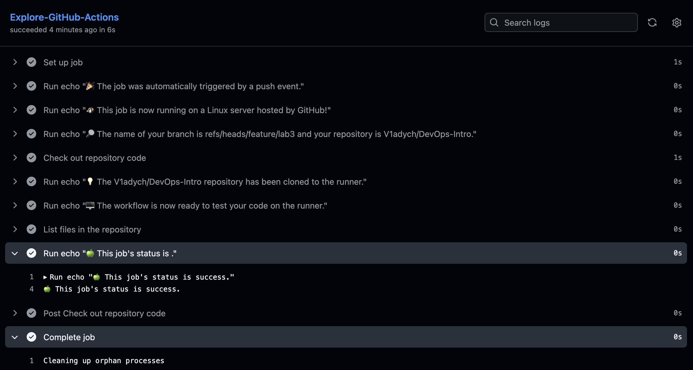

## Task 1
[Link to successful CI run](https://github.com/V1adych/DevOps-Intro/actions/runs/22234183791/job/64321501372)

Jobs are named entities in `.yaml` file that are being run
steps are consecutive bash / higher-order commands to be executed withing a job

The job trigger is defined with `on` entry. Since `[push]` was used, the job was triggered after the commit was pushed to remote

The workflow execution process was sequential wrt. steps defined in `.yaml`


## Task 2
With new commit, added `workflow_dispatch` trigger and `Gather system information` step to `.yaml`.

[push CI job link](https://github.com/V1adych/DevOps-Intro/actions/runs/22234977467/job/64324186621)

Gather information output:
```bash
Run echo "### Hardware Information"
  echo "### Hardware Information"
  lscpu | grep -E 'Model name|CPU\(s\)|Thread\(s\) per core|Core\(s\) per socket'
  echo "### Memory Information"
  free -h
  echo "### OS Information"
  lsb_release -a
  echo "### Disk Information"
  df -h
  shell: /usr/bin/bash -e {0}
### Hardware Information
CPU(s):                               4
On-line CPU(s) list:                  0-3
Model name:                           AMD EPYC 7763 64-Core Processor
Thread(s) per core:                   2
Core(s) per socket:                   2
NUMA node0 CPU(s):                    0-3
### Memory Information
               total        used        free      shared  buff/cache   available
Mem:            15Gi       1.0Gi        13Gi        39Mi       1.8Gi        14Gi
Swap:          3.0Gi          0B       3.0Gi
### OS Information
Distributor ID:	Ubuntu
Description:	Ubuntu 24.04.3 LTS
Release:	24.04
Codename:	noble
### Disk Information
Filesystem      Size  Used Avail Use% Mounted on
/dev/root       145G   53G   92G  37% /
tmpfs           7.9G   84K  7.9G   1% /dev/shm
tmpfs           3.2G 1016K  3.2G   1% /run
tmpfs           5.0M     0  5.0M   0% /run/lock
efivarfs        128M   29K  128M   1% /sys/firmware/efi/efivars
/dev/sda16      881M   62M  758M   8% /boot
/dev/sda15      105M  6.2M   99M   6% /boot/efi
tmpfs           1.6G   12K  1.6G   1% /run/user/1001
```

---

[workflow dispatch CI job link](https://github.com/V1adych/DevOps-Intro/actions/runs/22235790213/job/64326930129)

Gather information output:
```bash
Run echo "### Hardware Information"
  echo "### Hardware Information"
  lscpu | grep -E 'Model name|CPU\(s\)|Thread\(s\) per core|Core\(s\) per socket'
  echo "### Memory Information"
  free -h
  echo "### OS Information"
  lsb_release -a
  echo "### Disk Information"
  df -h
  shell: /usr/bin/bash -e {0}
### Hardware Information
CPU(s):                               4
On-line CPU(s) list:                  0-3
Model name:                           AMD EPYC 7763 64-Core Processor
Thread(s) per core:                   2
Core(s) per socket:                   2
NUMA node0 CPU(s):                    0-3
### Memory Information
               total        used        free      shared  buff/cache   available
Mem:            15Gi       945Mi        13Gi        39Mi       1.8Gi        14Gi
Swap:          3.0Gi          0B       3.0Gi
### OS Information
Distributor ID:	Ubuntu
Description:	Ubuntu 24.04.3 LTS
Release:	24.04
Codename:	noble
### Disk Information
Filesystem      Size  Used Avail Use% Mounted on
/dev/root       145G   53G   92G  37% /
tmpfs           7.9G   84K  7.9G   1% /dev/shm
tmpfs           3.2G  1.1M  3.2G   1% /run
tmpfs           5.0M     0  5.0M   0% /run/lock
efivarfs        128M   32K  128M   1% /sys/firmware/efi/efivars
/dev/sda16      881M   62M  758M   8% /boot
/dev/sda15      105M  6.2M   99M   6% /boot/efi
tmpfs           1.6G   12K  1.6G   1% /run/user/1001
```

Both manual and automatic workflow triggers were successful.
The system information gathered by the runner show that the execution was performed in `Ubuntu 24.04.3 LTS` with `AMD EPYC 7763 64-Core Processor` and approximately `16Gi` of memory. Environment is roughly the same for both triggers.
